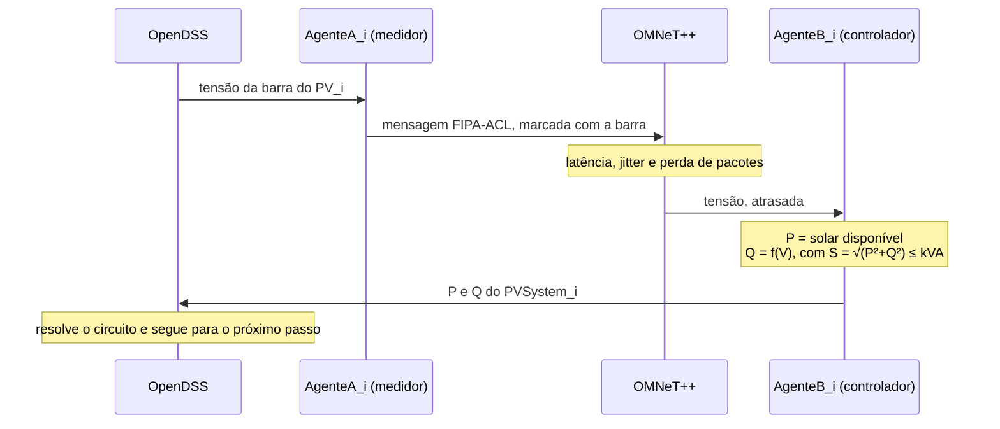

# Cenários e experimentos

Tudo se executa pelo script único `run.sh`, que faz a limpeza completa do Docker
antes e depois de cada passada e espera cada simulador ficar pronto pelo log.

```bash
./run.sh --help           # lista todos os comandos
./run.sh integrated       # a co-simulação completa, o comando do dia a dia
```

!!! note "Por que a limpeza é completa"

    Contêineres de *profile* não são removidos por um `docker compose down`
    simples e seguram a rede com um `Resource is still in use`, deixando um ID
    obsoleto que quebra o `up` seguinte. O `run.sh` derruba todos os profiles, os
    contêineres e a rede antes e depois de cada passada, o que também garante
    simuladores `--remote` frescos.

## Os quatro cenários

| Cenário | O que faz | Grava em |
|---|---|---|
| `integrated` | **a co-simulação completa** dos quatro domínios, com Volt/Var causal | `output/integrated/` |
| `market` | **mercado transativo**: negociação multiagente e OpenDSS | `output/market*/` |
| `ieee13` | rede elétrica isolada: OpenDSS, 5 sistemas fotovoltaicos e inversores | `output/ieee13/` |
| `star` | comunicação isolada: 50 agentes PADE em estrela pelo OMNeT++ | `output/star/` |

O `integrated` é **a** simulação, a aplicação da plataforma. O `ieee13` e o
`star` são bancadas de teste de cada bloco: servem para saber qual domínio
quebrou quando o integrado muda de comportamento.

### `integrated`, o laço causal

O cenário roda **duas vezes**, uma sem controle (`baseline`) e outra com Volt/Var
nos agentes, sobre a mesma semente de rede. Comparar as duas é o experimento.



Para o Mosaik aceitar o laço, a leitura da barra pelo medidor é `time_shifted`: o
medidor reporta o último estado resolvido, o que também quebra o ciclo algébrico
`DSS → PADE → PVSystem → DSS`.

### `market`, as quatro redes

A rede vem de `MARKET_NETWORK`, e cada uma responde a uma pergunta diferente.

| Rede | Barras | Para quê |
|---|---|---|
| `MVLV75` | 75 BT | a da tese de referência; é onde a comparação é feita |
| `13Bus` | 13 MT | o mesmo benchmark da plataforma, agora como caso de mercado |
| `BT16` | 16 BT | bancada: 0,3 s por rodada, para iterar sobre o mecanismo |
| `BT38` | 38 BT | a rede final do trabalho, com quatro alimentadores |

```bash
MARKET_NETWORK=13Bus ./run.sh market     # -> output/market_13Bus/
```

A MVLV75 não exibe sobretensão, e por isso metade do mecanismo ficava sem ser
exercitada: os alimentadores têm de 60 a 180 m e o fotovoltaico instalado é 0,37
do carregado, o que dá cerca de 0,006 pu de elevação ao meio-dia. As outras três
cobrem o caso em que os dois extremos da faixa ocorrem.

O `market` também roda **duas passadas**, uma sem mecanismo nenhum e outra com a
negociação, e a rede vê a **mesma demanda realizada** nas duas, o que isola o
efeito do mercado.

!!! warning "Cada rede grava o seu registro"

    O `run.json` da negociação vai para
    `simulators/market-opentes/data/run_<REDE>/`. Com um diretório só, a execução
    de uma rede sobrescrevia o registro da anterior, inclusive o da MVLV75, que
    figuras publicadas citam como procedência. Já aconteceu, com a execução da
    IEEE 13.

## Os experimentos

Variam parâmetros do cenário integrado. Todos editam o `omnetpp.ini` e **o
restauram ao final**, mesmo se interrompidos.

| Comando | O que faz | Grava em |
|---|---|---|
| `48h` | horizonte de 48 h, dois dias com a mesma irradiância, para verificar se o ciclo diário se repete. Perda 0% | `output/sensibilidade_48h/` |
| `loss-sweep` | sensibilidade do Volt/Var à perda: baseline mais 0, 25, 30, 35, 40, 45, 50, 75 e 100%, uma semente | `output/sensibilidade_perda/` |
| `loss-multiseed` | varredura completa de 0 a 100% em passos de 5%, com 20 sementes por nível estocástico | `output/sensibilidade_perda_multiseed/` |

```bash
./run.sh loss-sweep loss030 loss035   # roda só as passadas indicadas
```

O `loss-multiseed` é **resumível**: ele pula a passada cujo `result_<tag>.csv` já
existe, o que permite interromper e retomar uma varredura de centenas de
execuções. Os níveis determinísticos (0% e 100%) rodam com uma semente só, porque
ali a semente não muda o resultado.

A leitura detalhada dos resultados fica fora do repositório, em
`Docs_Externo/EXPERIMENTO_PERDA.md`.

## Variáveis que mudam o resultado

Todas têm valor padrão no `docker-compose.yaml`. As que mais importam:

=== "Controle e co-simulação"

    | Variável | Padrão | O que muda |
    |---|---|---|
    | `CONTROL_ENABLED` | `1` | liga o Volt/Var; `0` é a passada de baseline |
    | `Q_MAX_PCT` | `0.05` | teto de reativo do inversor, como fração do kVA |
    | `V_DEADBAND` | `0.02` | largura da zona morta em torno de 1,0 pu |
    | `MOSAIK_OUTPUT_DIR` | por cenário | para onde vão os resultados |
    | `OMNET_STEP` | `300` | passo da co-simulação, em segundos |

=== "Mercado"

    | Variável | Padrão | O que muda |
    |---|---|---|
    | `MARKET_NETWORK` | `MVLV75` | qual rede de teste |
    | `MARKET_V_BACKOFF` | `1e-3` | margem na restrição de tensão, contra o erro da linearização |
    | `MARKET_MAX_ROUNDS` | `60` | teto de rodadas; precisa acompanhar o backoff |
    | `MARKET_ALPHA` | `0.6` | passo da decomposição dual |
    | `MARKET_SCENARIOS` | `1` | cenários por prosumidor; 1 é determinístico |
    | `MARKET_REALIZED_MODE` | `perturb` | como a demanda realizada difere da programada |
    | `MARKET_STORAGE_PF` | `none` | fator de potência do armazenamento; `none` reproduz a tese |
    | `MARKET_SOLVER` | `cplex` | solver de otimização |

=== "Rede de comunicação"

    | Variável | Padrão | O que muda |
    |---|---|---|
    | `NET_BACKEND` | `ideal` | camada de rede entre os agentes: `ideal`, `lossy` ou `omnet` |
    | `OMNET_HOST`, `OMNET_PORT` | `comm`, `5555` | onde está a ponte ZMQ do OMNeT++ |
    | `PADE_HOST`, `PADE_PORT` | por cenário | onde está o runtime dos agentes |

    A perda de pacotes do cenário de validação não é uma variável de ambiente: ela
    é `drop_probability`, no `simulators/comm-opentes/omnetpp.ini`, e é **parâmetro
    de modelo**, não resultado. Os experimentos a editam e restauram.

## O que cada cenário grava

```text
output/integrated/      result_{baseline,volt_var}.csv, comm_trace_{...}.csv,
                        dashboard_integrated.png, comparacao_volt_var.png,
                        analise_comunicacao.png
output/market*/         result_{baseline,negociado}.csv, dlmp.csv,
                        transactions.csv, flexibility.csv, market_series.csv
output/ieee13/          result_run_ieee13_cosim_pv_5min.csv, ieee13_dashboard.png
output/star/            results.csv, grafico_trafego.png
output/sensibilidade_*/ uma passada por nível, mais a figura do experimento
```

A pasta `output/` é ignorada pelo git, porque são produtos de simulação. A
explicação de cada arquivo, coluna a coluna, está no
[guia da pasta `output/`](RESULTADOS.md).
