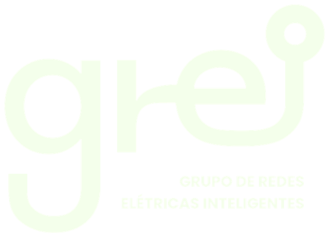
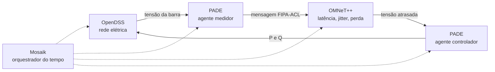

---
hide:
  - navigation
  - toc
---

{ .off-glb }

# Co-simulação multidomínio para redes elétricas inteligentes

Quatro simuladores, um por domínio, sincronizados por um orquestrador de tempo:
os agentes decidem no **PADE**, as mensagens atravessam o **OMNeT++**, a rede
elétrica é resolvida pelo **OpenDSS** e o **Mosaik** acerta o relógio entre eles.
Sobre a mesma plataforma roda a camada de mercado transativo.

[Começar](instalacao.md){ .md-button .md-button--primary }
[Mapa do repositório](GUIA.md){ .md-button }

## Por que co-simular

Avaliar uma rede de distribuição com geração distribuída e prosumidores
negociando energia exige três coisas ao mesmo tempo, e elas costumam ser
simuladas em separado:

1. **A rede elétrica.** Onde a tensão cai, onde o transformador satura.
2. **A rede de comunicação.** Quanto tempo uma mensagem leva, quantas se perdem.
3. **A decisão dos agentes.** Quem propõe o quê, quem aceita, a que preço.

Simular só a primeira dá um estudo de fluxo de potência. Simular as três juntas
mostra o que nenhuma delas mostra sozinha, por exemplo que um protocolo de
negociação que funciona com entrega instantânea perde propostas quando a entrega
atrasa, e que a programação resultante viola a tensão que ela deveria proteger.

O Mosaik é o maestro: ele decide quem executa em que instante e transporta os
dados. Nenhum simulador conhece os outros.

## O que já foi medido

<strong>0,00044 pu</strong>
erro médio do circuito IEEE 13 contra o perfil de tensão publicado

<strong>−15%</strong>
desvio-padrão da tensão com o Volt/Var nos agentes, e −20% na barra crítica

<strong>17,4%</strong>
perda de pacotes medida no canal, sobre o parâmetro de 15% do modelo

<strong>171 → 0</strong>
violações de tensão eliminadas pela negociação de mercado no IEEE 13

!!! success "O laço causal fecha"

    No cenário `integrated`, a tensão que chega ao controlador passou por um
    modelo de rede explícito. Ao longo de um dia, os cinco medidores enviam 1.227
    pacotes e 213 são descartados; a latência fica entre 32 e 451 ms. O controle
    eleva as barras subtensionadas no fim do dia (barra 652, de 0,9203 para
    0,9366 pu) e corta a sobretensão da tarde (barra 646, de 1,0517 para
    1,0437 pu).

!!! warning "A comunicação limita o ganho seguro do controle"

    Com os 44% do kVA que a IEEE 1547 sugere para reativo, os cinco inversores
    agindo ao mesmo tempo sob atraso e perda sobre-injetam, e a tensão chega a
    1,12 pu. O ganho padrão da plataforma é deliberadamente suave por causa
    disso, e esse acoplamento é um resultado do benchmark, não um detalhe de
    ajuste.

## Por onde seguir

### :material-rocket-launch: Instalação e execução
Os dois caminhos, Docker e `uv`, e o que cada um alcança.

[Ler mais →](instalacao.md)

### :material-play-box-multiple: Cenários e experimentos
O que cada comando do `run.sh` faz, o que ele grava e quais variáveis mudam o
resultado.

[Ler mais →](cenarios.md)

### :material-map: Mapa do repositório
Para quem abre a pasta pela primeira vez: o que há em cada diretório e por quê.

[Ler mais →](GUIA.md)

### :material-source-branch: Integração
O que foi alterado em cada componente para que os simuladores das três equipes
funcionassem juntos, e o motivo de cada alteração.

[Ler mais →](INTEGRACAO.md)

### :material-chart-line: Guia da pasta `output/`
Cada arquivo de resultado, coluna a coluna, e cada figura, quadro a quadro.

[Ler mais →](RESULTADOS.md)

### :material-swap-horizontal: Mercado transativo
A formulação, equação por equação, a correspondência com a tese de referência e
os desvios assumidos.

[Ler mais →](MERCADO.md)

## Quem fez

Trabalho do time **TTESO** no projeto OpenTES, do [GREI](https://github.com/grei-ufc),
o Grupo de Redes Elétricas Inteligentes da Universidade Federal do Ceará. A
plataforma reúne o que três equipes desenvolveram em separado:

| Equipe | Contribuição | Onde está |
|---|---|---|
| TSCC | rede de comunicação e o primeiro cenário PADE + OMNeT++ + Mosaik | `simulators/comm-opentes`, `mosaik-opentes` |
| TSRE | rede elétrica, sistemas fotovoltaicos e o controle Volt/Var de origem | `simulators/grid-opentes` |
| TTESO | agentes, otimização, camada transativa e a integração | `simulators/pade-opentes`, `market-opentes` |
